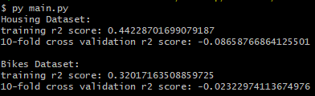

# EECS 738 Project 3: Says One Neuron to the Other

### Submission by Benjamin Wyss

Constructing a neural network regressor from scratch to test and tune its performance on well-known datasets.

## Datasets Examined

Boston Housing Dataset - taken from https://www.kaggle.com/puxama/bostoncsv on 4/23/21

Task: Predict the median housing value of a given Boston housing district using features about the district.

 

Bike Sharing Dataset - taken from https://archive.ics.uci.edu/ml/datasets/bike+sharing+dataset on 4/23/21

Task: Predict the quantity of bike share bikes used during a given hour of a day using features about the day.

## Ideas

A neural network regressor will be able to perform the tasks of each data set since it can learn a mapping from numeric inputs to a numeric output. Using simple repeated forward and back propagation, the neural network regressor will learn the task of the dataset. To improve the accuracy of predictions, hyperparameters should be able to be tuned, such as the width, depth, activation function, number of learning iterations, and the learning rate of the neural network.

## Process

Training the neural network regressor requires weight and bias initialization followed by repeated forward and back propagation. Weight initialization is implemented by assigning each weight and bias in the network to a normally distributed random variable. Next, for a number of hyperparameter-specified iterations, the dataset's values travel through the neural network's layers by multiplying by weights, summing with biases, and applying a hyperparameter-specified activation function to the result (available options are sigmoid and ReLU), until the final output layer values are determined. From the output layer's values, the mean squared error between the calculated and expected values of the task is calculated. Using this mean squared error and the chain rule, weights and biases are updated by applying backpropagated gradient descent to determine how each weight and bias should change in value.

One challenge I encountered during implementation was that some random initializations of weights and biases could cause the backpropagated gradient descent to diverge, resulting in mean squared errors that approach infinity. I overcame this challenge by detecting when a bad value for mean squared error is reached so that weights and biases can be re-initialized. This problem appears to occur more often with higher learning rates and when the ReLU activation function is used, but in most cases this solution will eventually result in a good weight and bias initialization.

To test the performance of the neural network, the coefficient of determination (r2 score) comparing the actual and expected values of the given task is calculated upon completing model training. K-fold cross validation using r2 score is also implemented so that a neural network can be more tested on data which it has not learned.

## Results

This project can be run by executing the [main.py](main.py) file with python3. Executing this file will train two neural network regressors--one for the housing dataset and one for the bikes dataset. The program outputs the training and 10-fold cross validation r2 scores for each dataset. The hyperparameters of each model can be tuned by locally editing [main.py](main.py) and then executing the program again. From my testing, I have found some hyperparameters that appear to offer a mix of accuracy and execution speed.

From testing and tuning this implementation, it appears that hyperparameter tuning is crucial for achieving acceptable performance. Without much hyperparameter tuning, trained models have a tendency to always predict the mean target value of a task, approaching a maximal possible r2 score of 0. By widening the neural network and decreasing the learning rate, the neural network is able to learn a dataset's given task with some efficiency, although these models still tend to struggle with the untrained data encountered in 10-fold cross validation tests. Some sample results of trained models are pictured below.

While this performance is not impressive, it is very promising. Deeper and wider networks should be able to learn more complex taks with higher overall accuracy. Despite this, the time required to train even a small neural network is quite costly, thus I was unable to test very wide and deep neural networks with my current implementation. 

## Conclusions

This project required some heavy implementation of challenging math, and the neural networks that I constructed showed flexibility and promising results. With performance optimizations, this implementatino could tackle wider and deeper networks, hopefully boasting very strong task performance. With better performance, techniques such as regularization to combat overfitting would also constitute valuable future work. Overall, this project has greatly deepened my understanding of neural networks, hyperparameter tuning, and optimization considerations.
